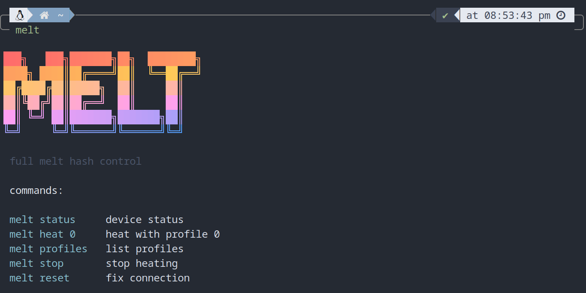

# melt

> **⚠️ Status:** The BLE library has been swapped from `@abandonware/noble` to `@stoprocent/noble` for better Linux support. The installer and CLI are verified to work; live device communication is pending further testing. YMMV — please report any issues.

Full melt hash control. Terminal-based Puffco controller.

```
 ███╗   ███╗███████╗██╗  ████████╗
 ████╗ ████║██╔════╝██║  ╚══██╔══╝
 ██╔████╔██║█████╗  ██║     ██║
 ██║╚██╔╝██║██╔══╝  ██║     ██║
 ██║ ╚═╝ ██║███████╗███████╗██║
 ╚═╝     ╚═╝╚══════╝╚══════╝╚═╝
```

## Install

Clone the repo and run the installer:

```bash
git clone https://github.com/jen88uk/melt-linux.git
cd melt-linux
chmod +x install.sh
./install.sh
```

The installer will:
- Install `bluez` and `bluez-utils` via `pacman`
- Enable the Bluetooth service
- Compile native dependencies
- Grant BLE permissions to Node.js (`setcap`)
- Install a `pacman` hook to preserve permissions on Node upgrades
- Register `melt` as a global command

> **Note:** You will need `sudo` access. Node.js 18+ must be installed beforehand (`sudo pacman -S nodejs npm`).

## Uninstall

```bash
./uninstall.sh
```

Removes only what the melt installer added: the global `melt` command, the pacman hook, the udev rule, and `node_modules`. It will **not** remove Node.js, npm, bluez, or the Bluetooth service. You will be prompted before BLE capabilities are removed from Node.js, in case other tools depend on them.

> **Note:** `uninstall.sh` is generated by `install.sh` and tailored to your machine — it only removes what was actually installed. It is not included in the repo.

## Usage

```bash
melt              # show help
melt status       # battery, temp, dab count
melt profiles     # list heat profiles
melt heat 0       # heat with profile 0
melt stop         # stop heating
melt reset        # fix connection issues
```

**Tip:** If you have multiple Bluetooth adapters, select a specific one with:

```bash
NOBLE_HCI_DEVICE_ID=1 melt status
```

## Requirements

- Linux (Arch-based: Arch, Manjaro, EndeavourOS, etc.)
- Node.js 18+
- BlueZ (`bluez`, `bluez-utils`) — installed automatically by the installer
- Puffco Proxy (tested on latest firmware)

## Screenshot


## Credits

`melt` was originally created by **[ryleyio](https://github.com/ryleyio)** for macOS.  
This repository is a Linux port, adapted to run on Arch-based systems using `@stoprocent/noble` and BlueZ.  
Full credit for the original application, protocol work, and UI goes to ryleyio.

## Disclaimer

Unofficial tool. Not affiliated with Puffco. Use at your own risk.

If you'd like to support the work that made this possible, you can buy the **original author (ryleyio)** a coffee:

<a href="https://buymeacoffee.com/ryleyio" target="_blank">
  
</a>
